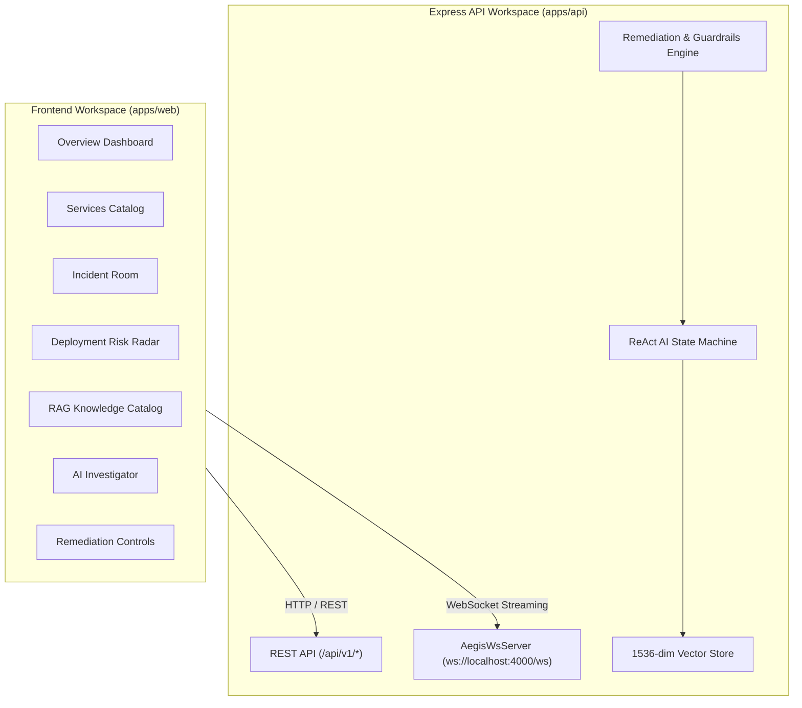

# Aegis — AI Engineering Reliability & Autonomous Remediation Platform


**Aegis** is an enterprise-grade AI-powered engineering reliability, telemetry correlation, and autonomous incident remediation platform. It connects production microservice mesh topology, real-time WebSocket metric streams, CI/CD deployment risk scores, 1536-dimensional RAG vector store runbooks, autonomous ReAct AI agent loops, and human-in-the-loop remediation playbooks.

---

## 🚀 Key Features & Capabilities

- 📊 **Overview Command Dashboard**: Real-time telemetry sparklines, active incident alerts, and service health overview.
- 🕸️ **Microservices Mesh & Topology**: Service dependency topology graphs, SLA latency tracking (P95/P99), and endpoint monitoring.
- 🚨 **Incident Command Room**: Interactive incident room with real-time WebSocket timeline streams, severity badges, and status steppers.
- 🛡️ **CI/CD Deployment Risk Radar**: Machine-learned deployment risk scoring (0–100), changed file diff inspection, and historical incident correlation.
- 📚 **RAG Knowledge Base Engine**: Document ingestion pipeline splitting Markdown runbooks into semantic chunks with 1536-dimensional cosine similarity vector search.
- 🤖 **Autonomous AI ReAct Investigator**: Multi-tool reasoning state machine (*Thought $\rightarrow$ Action $\rightarrow$ Observation $\rightarrow$ Hypotheses*) executing `queryLogs`, `getRecentDeployments`, `searchKnowledge`, and `getServiceDependencies`.
- ⚡ **Automated Remediation & Safety Guardrails**: Human-in-the-loop mitigation playbooks (`rollback_deployment`, `scale_service`, `toggle_circuit_breaker`, `flush_cache`) enforcing risk-based authorization policies.

---

## 🏗️ Architecture Overview



---

## 📁 Repository Structure

```
aegis/
├── apps/
│   ├── api/                  # Express.js REST API & WebSocket Event Server
│   │   ├── src/ai/           # ReAct Agent Engine & Tool Execution Registry
│   │   ├── src/rag/          # Document Chunker & 1536-dim Vector Store
│   │   ├── src/remediation/  # Mitigation Playbooks & Safety Guardrails
│   │   └── src/websocket/    # AegisWsServer & Telemetry Ticker
│   └── web/                  # Next.js 14 Web Application (App Router)
│       ├── src/app/          # Page routes (Dashboard, Services, Incidents, etc.)
│       ├── src/components/   # UI & Layout components
│       └── src/hooks/        # Custom React data hooks (useServices, useRagSearch)
├── packages/
│   └── types/                # Shared TypeScript domain interfaces (@aegis/types)
└── docs/                     # Architectural decision records & blueprints
```

---

## ⚡ Quickstart & Local Development

### Prerequisites
- Node.js $\ge$ 18.0.0
- npm $\ge$ 9.0.0

### Installation & Setup

1. **Clone repository**:
   ```bash
   git clone https://github.com/Rohan-shiva/aegis-engineering-reliablity-plateform.git
   cd aegis
   ```

2. **Install monorepo dependencies**:
   ```bash
   npm install
   ```

3. **Run Type-Check**:
   ```bash
   npm run type-check --workspace=apps/api
   npm run type-check --workspace=apps/web
   ```

4. **Start Development Servers**:
   ```bash
   # Start backend API (Port 4000)
   npm run dev --workspace=apps/api

   # Start frontend UI (Port 3000)
   npm run dev --workspace=apps/web
   ```

---

## 📡 API Endpoint Overview

| Endpoint | Method | Description |
| :--- | :--- | :--- |
| `/api/v1/system/status` | `GET` | Live platform readiness and component diagnostics. |
| `/api/v1/system/benchmark` | `POST` | Executes automated vector search & ReAct loop benchmark suite. |
| `/api/v1/rag/search` | `POST` | 1536-dimensional vector similarity query over knowledge base. |
| `/api/v1/ai/investigate` | `POST` | Triggers autonomous ReAct AI agent incident investigation. |
| `/api/v1/remediation/actions` | `GET`, `POST` | List and queue incident mitigation playbook actions. |
| `/api/v1/remediation/actions/:id/approve` | `POST` | Authorizes pending high-risk remediation action. |

---

## 📄 License
Distributed under the MIT License. See `LICENSE` for details.
