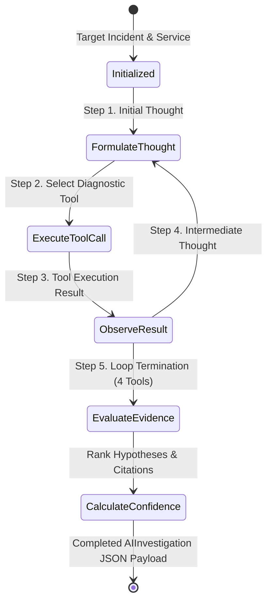

# Autonomous AI Incident Agent & ReAct Reasoning Architecture

## 1. Executive Summary & Overview
The **Aegis Autonomous AI Incident Agent** executes multi-step diagnostic reasoning loops over microservice telemetry, log error traces, deployment histories, topology dependency graphs, and RAG vector store runbooks.

By utilizing a structured **ReAct (Reasoning + Acting)** state machine, the agent formulates intermediate hypotheses, determines required tool diagnostic calls, executes tool actions, evaluates observations, and synthesizes root-cause hypotheses with weighted confidence scores and recommended mitigation steps.

---

## 2. ReAct State Machine Loop



### Execution Phases:
1. **Thought Phase**: Agent analyzes the target incident code, affected service name, and preceding observations to select the next diagnostic tool.
2. **Action Phase**: Invokes registered tools (`getRecentDeployments`, `queryLogs`, `searchKnowledge`, `getServiceDependencies`, `getRunbook`) with explicit parameter arguments.
3. **Observation Phase**: Captures execution runtime latency and structured diagnostic results.
4. **Synthesis Phase**: Evaluates accumulated evidence matrix, assigns confidence percentages (0–100%), and produces actionable mitigation procedures.

---

## 3. Pluggable Tool Execution Registry

The `ToolRegistry` (`apps/api/src/ai/toolRegistry.ts`) exposes 5 core diagnostic tools:

| Tool Name | Parameters | Description |
| :--- | :--- | :--- |
| `getRecentDeployments` | `serviceName`, `limit` | Queries recent production/staging commit rollouts, risk scores, and changed files. |
| `queryLogs` | `serviceName`, `query` | Searches log error streams for exception stack traces, connection pool timeouts, and 500 status codes. |
| `searchKnowledge` | `query`, `topK` | Executes 1536-dim vector similarity search over RAG vector store runbooks and postmortems. |
| `getServiceDependencies` | `serviceName` | Inspects upstream and downstream topological service dependencies and health statuses. |
| `getRunbook` | `topic`, `serviceName` | Retrieves official incident remediation runbook guidelines. |

---

## 4. Evidence Correlation & Confidence Scoring Formula

The overall investigation `confidenceScore` is calculated dynamically by the `HypothesisEngine` (`apps/api/src/ai/hypothesisEngine.ts`):

$$\text{Confidence} = \min\left(98,\; 70 + \mathbf{I}_{\text{deploy}} \cdot 12 + \mathbf{I}_{\text{logs}} \cdot 10 + \mathbf{I}_{\text{rag}} \cdot 5\right)$$

Where:
- $\mathbf{I}_{\text{deploy}} = 1$ if high-risk deployment rollouts correlate with alert timestamp.
- $\mathbf{I}_{\text{logs}} = 1$ if explicit 500 error traces / pool timeout stack dumps are retrieved.
- $\mathbf{I}_{\text{rag}} = 1$ if high-scoring vector similarity matches ($>0.85$) are matched in the knowledge base.

---

## 5. REST API Specification

### 1. Trigger ReAct Agent Investigation
- **Endpoint**: `POST /api/v1/ai/investigate` (or `POST /api/v1/investigate`)
- **Request Body**:
  ```json
  {
    "targetIncidentCode": "INC-8092",
    "targetServiceName": "auth-identity-svc",
    "title": "Automated ReAct Root Cause Analysis: INC-8092"
  }
  ```
- **Response**: `201 Created` with full `AIInvestigation` JSON object.

### 2. List Investigations
- **Endpoint**: `GET /api/v1/ai/investigations`
- **Query Parameters**: `status` (completed/analyzing), `search` (filter string).
- **Response**: `200 OK` with array of investigations.

### 3. Get Investigation Detail
- **Endpoint**: `GET /api/v1/ai/investigations/:id`
- **Response**: `200 OK` with targeted investigation object.
