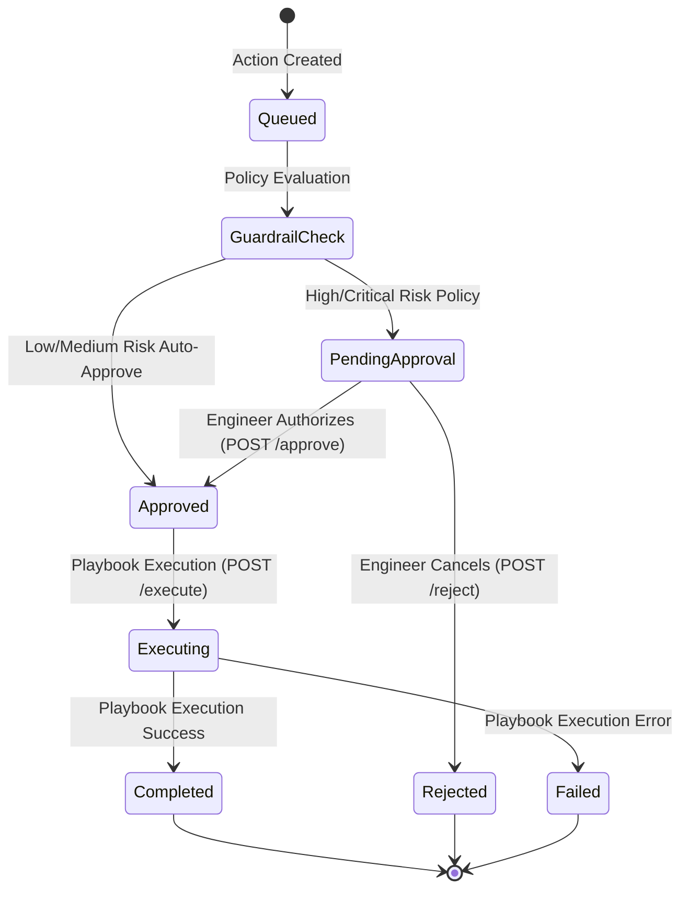

# Automated Incident Mitigation & Remediation Playbooks Architecture

## 1. Executive Summary & Overview
The **Aegis Remediation & Safety Guardrail Engine** enables automated incident mitigation via pluggable playbooks (`rollback_deployment`, `scale_service`, `toggle_circuit_breaker`, `flush_cache`).

To prevent destructive automated operations on production workloads, Aegis enforces **Safety Guardrail Policies** and a **Human-in-the-Loop Approval Workflow**. High-risk and critical actions (such as production deployment rollbacks) require explicit authorization from an engineer before execution.

---

## 2. Human-in-the-Loop Approval State Machine



### Action Lifecycle States:
- `pending_approval`: High-risk action intercepted by safety guardrails. Awaiting engineer approval in UI.
- `approved`: Action authorized by an engineer (or auto-approved by low-risk policy). Ready for playbook execution.
- `executing`: Playbook actively executing container scaling, rollback manifest updates, or cache flushes.
- `completed`: Playbook finished successfully; execution logs and duration recorded.
- `rejected`: Action explicitly cancelled by an engineer.
- `failed`: Playbook encountered execution error.

---

## 3. Playbook Registry & Risk Classifications

The `RemediationRegistry` (`apps/api/src/remediation/remediationRegistry.ts`) defines 4 core playbooks:

| Playbook Action | Risk Level | Human Approval Required | Description |
| :--- | :--- | :--- | :--- |
| `rollback_deployment` | **HIGH** | **Yes** | Reverts Kubernetes / GitOps deployment to previous stable commit SHA. |
| `scale_service` | **MEDIUM** | **No** (Auto-Approved) | Adjusts HorizontalPodAutoscaler min/max replicas or connection pool limits. |
| `toggle_circuit_breaker` | **LOW** | **No** (Auto-Approved) | Enables Istio / Envoy circuit breaker fallback route rules. |
| `flush_cache` | **LOW** | **No** (Auto-Approved) | Clears Redis key namespaces during memory pressure or token invalidation. |

---

## 4. REST API Specification

### 1. List Remediation Actions
- **Endpoint**: `GET /api/v1/remediation/actions`
- **Query Parameters**: `incidentId`, `status`.
- **Response**: `200 OK` with array of `RemediationAction` objects.

### 2. Create / Queue Remediation Action
- **Endpoint**: `POST /api/v1/remediation/actions`
- **Request Body**:
  ```json
  {
    "incidentId": "INC-8492",
    "serviceName": "payment-checkout-svc",
    "actionType": "rollback_deployment",
    "targetVersion": "7b19a04f"
  }
  ```
- **Response**: `201 Created` with initial action object.

### 3. Approve Action (Human-in-the-Loop)
- **Endpoint**: `POST /api/v1/remediation/actions/:id/approve`
- **Request Body**: `{ "engineerName": "Elena Rostova" }`
- **Response**: `200 OK` with updated status `approved`.

### 4. Reject Action
- **Endpoint**: `POST /api/v1/remediation/actions/:id/reject`
- **Request Body**: `{ "reason": "Manual investigation in progress" }`
- **Response**: `200 OK` with updated status `rejected`.

### 5. Execute Playbook Action
- **Endpoint**: `POST /api/v1/remediation/actions/:id/execute`
- **Response**: `200 OK` with execution logs, latency duration, and status `completed`.
- **Safety Violation**: Returns `400 Bad Request` if action status is not `approved`.
